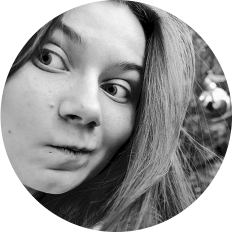

# Lina Gorislavka 
## Currently searching for a frontend development internship
Female, born on 27 August\
[GitHub](https://github.com/LinaGorihvostka) / [Email](lina.editor@gmail.com) — preferred way of communication \
(025) 988-77-**\
Belarus, Minsk, Malinovka / Aeradromnaja metro station

------

### Desired position

— __Junior frontend developer__\
_Employment_: project work, part-time, full-time\
_Work schedule_: remote working, flexible schedule, full day, shift schedule\
_Desired travel time to work_: up to one hour

------

### Profile

For many years I worked as a project manager in the publishing business. At the beginning of 2020, I caught a professional burnout, recovered, and decided to change the field of activity with renewed forces. I started learning coding in November 2020. I posted my learning way on Reddit and with this story in December [🏆 won](https://www.reddit.com/r/Hyperskill/comments/keu4ad/just_try_it_i_found_funny_pics_to_entertain_and/) the competition [Hour of Code](https://www.reddit.com/r/Hyperskill/comments/k02pxr/hour_of_code_with_jetbrains_academy_get_a_chance/) from JetBrains Academy.

I get pleasure from any system. I like to organize things and make them beautiful. I think it's perfectly connected in the front-end developer journey. I don't like inefficiency and wasted energy consumption, so I always looking for ways to improve something and automate routine operations. 

I love to learn everything around and I'm not afraid to get bumps: I mastered a bicycle at the age of 25.\
I can clearly explain everything I know myself. I can teach and motivate other people.\ 
I'm a non-destructive perfectionist, but I'm struggling with it, so one of the tests in RSS I passed at 97/100. 

------

### Key skills

— __Hard skills__

- _Frontend development_: HTML5, CSS3, JavaScript, Git, Markdown
- _Web design_: typography, composition, color theory
- _UI-design_: prototyping, UX and ergonomics; Figma
- _Graphic editors_: Adobe Photoshop, Adobe Illustrator, Adobe Lightroom, Adobe InDesign
- _Other_: retouching, collage, illustration, animation, polygraphic layout and pre-press, copywriting

— __Essential skills__

- _Self-management:_\
love of learning, appreciation of Beauty & Excellence\
curiosity, perseverance _/at this point, I thought I am a Mars rover/_\
emotional intelligence, reflection, feedback using, stress management\
time management, motivation and goal setting\
bravery, fairness, honesty
- _Communication:_\
a sense of humor, listening skills, clear communication\
social intelligence, teamwork, feedback mastery\
facilitation, conflict resolution\
persuasion and reasoning, business conversation, negotiation, public performance\
written and verbal literacy

- _Thinking:_\
systemic, structural, logical thinking\
search, analysis and synthesis of information\
proofreading vigilance

— __Organizational soft skills__ 

- leadership, delegation\
planning, setting tasks, execution control, control over the implementation of tasks\
motivation, mentoring and coaching 

— __Languages__

- _Russian_ — Native
- _English_ — B1/B2 — Upper-Intermediate
- _Belarusian_ — C2 — Proficiency
- _Polish_ — A1 — Elementary

------

### Work experience — 8 years

_February 2020 – February 2021, till now (1 year)_ \
— __Copywriter__ \
— Freelance, Remote
- Writing articles, long reads, advertising texts.

_June 2017 — February 2020 (2 years 9 months)_ \
— __Executive editor / Publishing project manager__ (children's educational literature)\
— [«Aversev»](www.aversev.by) publishing house, Minsk

- I controlled the life cycle of projects: launch, structure development; supported business processes and prepress, controlled deadlines and releases, and managed the budget. I've released over 30 new books at a time.\
I managed the current product portfolio and the content of the products: I analyzed the market to identify customer needs, analyzed competing products, and researched the target audience. At a time I supported more than 100 finished books. \
I planned teamwork: prioritization of tasks, estimation, and control of deadlines. \
I made the requirements for performers: created prototypes, guidelines, developed visual styles of publications.\
I communicated with stakeholders, negotiated with authors and clients to establish long-term relationships.\
In 2018 I completed a complex task: I found a promising but unknown author, published with him 16 publications in the field of complex competition and I brought the project to payback in the first year; the project began to be profitable in the second year. \
I have completed a challenging project in a very short time — 3 months (the normal period — 9 months).

_March 2015 — march 2017 (2 years 1 month)_ \
— __Publishing editor__ (children's periodicals)\
— [«Pačatkovaja škoła»](p-shkola.by/) publishing house, Minsk

- I worked as a project/product manager and literary editor. \
In March 2015, I created the concept of the product — a series of training magazines for elementary school [«Otlichnik»](https://vk.com/topic-97568620_32759316). I developed the processes for the production of the project and found the performers. For 2 years, every month I published 3 children's magazines. \
I was responsible for the publishing process at all stages: made a technical project — searched and controlled the performers and deadlines of the projects — supported prepress process.\
I made up a thematic and content plan for each magazine; I developed a marketing strategy and promoting the product. I led the product page on social media. \
I have created and edited content in magazines: literary texts and educational assignments, illustrations. \
In the spring of 2016 the «Otlichnik» series [won](http://mininform.gov.by/meropriyatiya/konkursy-dlya-smi/goladli/pobediteli-2016-goda/) the national competition 🏆 [«Golden Letter»](http://mininform.gov.by/meropriyatiya/konkursy-dlya-smi/goladli/o-konkurse-zolotaya-litera/) and received the award in the nomination «The best materials for children and youth».

_January 2013 — March 2015 (2 years 3 months)_ \
— __Web-designer__ \
— «Advertum-Promo» advertising agency, Minsk

- I developed prototypes of landing pages; created static layouts of page designs in Adobe Photoshop; prepared mock-up files for layout. \
I analyzed landing pages and multipage sites in terms of usability and proposed improvements that increase conversion. 
Created graphic and text content for sites according to the client's technical specifications. I have a portfolio — corporate image sites, one-page business card sites, landing pages. 

------

### Projects

- [Jon Snow's CV](https://jolly-galileo-cd27cd.netlify.app) — 7-day layout marathon from [Algoritmika](https://bootcamp.algoritmika.org/marathon)
- [Procrastinate.](https://heuristic-elion-af7563.netlify.app) — training project from [Yandex.Praktikum](https://praktikum.yandex.ru/profile/web/)
- [4 layout rules](https://compassionate-lalande-7b247a.netlify.app) — training project from [Yandex.Praktikum](https://praktikum.yandex.ru/profile/web/)
- [Virtual Piano](https://linettevirtualpiano.000webhostapp.com) — training [project](https://hyperskill.org/projects/101?track=1) from Frontend Developer track _(JetBrains Academy)_
- [Coffee Machine](https://github.com/LinaGorihvostka/CoffeeMachine) — training [project](https://hyperskill.org/projects/33?track=1) from Java Developer track _(JetBrains Academy)_

------

### Code sample
```
<!DOCTYPE html>
<html lang="en">
    <head>
        <!-- Jon Snow's CV -->
        <meta charset="utf-8">
        <title>Personal page</title>
        <link rel="stylesheet" href="style.css">
    </head>

    <body>
        <div class="container">
            <div class="aside">
                
                
                <h1 class="title">Jon Snow</h1>
                
                <p class="birth-info">
                <b>Birth date:</b> 15.08.1986
                </p>
                
                <p class="birth-info">
                <b>Birth place:</b> Winterfell, Westeros
                </p>

                <div class="socials">
                    <a href="https://www.facebook.com" target="_blank"></a>
                    <a href="https://www.instagram.com" target="_blank"></a>
                    <a href="https://www.twitter.com" target="_blank"></a>
                </div>
            </div>
    
            <div class="main">
                <p class="description">
                    Jon Snow is a fictional character in the A Song of Ice and Fire series of fantasy novels by American author George R. R. Martin
                </p>
    
                <h2 class="section-title">Work experience</h2>
                <ul class="list">
                    <li><b><span class="position">Lord Commander</span> at Night Watch</b><br>
                    Oct 2018 — Dec 2020</li>
                    <li><b><span class="position">Warden of the North</span> at Westeros</b><br>
                    Jul 2016 — Sep 2018</li>
                    <li><b><span class="position">Brother</span> at Night Watch</b><br>
                    Jan 2014 — Jun 2016</li>
                </ul>

                <h2 class="section-title">Education</h2>
                <ul class="list">
                    <li><b><span class="position">Winterfell State University</span></b><br>
                    Sep 2008 — Jun 2013</li>
                    <li><b><span class="position">Winterfell High School</span></b><br>
                    Sep 1999 — May 2008</li>
                </ul>
            </div>
        </div>

        <div class="gallery">
            <div class="gallery-item">
                
                <p class="gallery-label">Jon Snow and Tormund</p>
            </div>
            
            <div class="gallery-item">
                
                <p class="gallery-label">Young Jon Snow</p>
            </div>
            
            <div class="gallery-item">
                
                <p class="gallery-label">Jon Snow and his [SPOILER!]</p>
            </div>
            
            <div class="gallery-item">
                
                <p class="gallery-label">Jon Stark</p>
            </div>
        </div>
    </body>
</html>


.gallery {
    width: 935px;
    height: 206px;
    display: flex;
    margin: 30px auto;
    box-sizing: border-box;
}

.gallery-item {
    width: 206px;
    height: 206px;
    margin: auto;
    position: relative;
}

.gallery-item:hover .gallery-label {
    display: block;
}

.gallery-label {
    display: none;
    width: 100%;
    font-size: 12px;
    font-weight: 700;
    background-color: #1A142D;;
    color: white;
    position: absolute;
    bottom: 0px;
    padding: 5px 12px;
    box-sizing: border-box;    
}

let phrases = [
  { text: 'отправить другу смешную гифку', image: 'https://code.s3.yandex.net/web-code/procrastinate/1.gif' },
  { text: 'посмотреть скидки на авиабилеты', image: 'https://code.s3.yandex.net/web-code/procrastinate/2.png' },
  { text: 'разобраться, о чём поют рэперы', image: 'https://code.s3.yandex.net/web-code/procrastinate/3.png' },
  { text: 'Юрий Дудь', image: 'https://code.s3.yandex.net/web-code/procrastinate/4.png' },
  { text: 'расставить книги на полке по цвету', image: 'https://code.s3.yandex.net/web-code/procrastinate/5.png' },
  { text: 'читать про зарплаты в Сан-Франциско', image: 'https://code.s3.yandex.net/web-code/procrastinate/6.png' },
  { text: 'прочитать новости и ужаснуться в комментариях', image: 'https://code.s3.yandex.net/web-code/procrastinate/7.png' },
  { text: 'попасть в поток грустных песен и вспомнить все ошибки молодости', image: 'https://code.s3.yandex.net/web-code/procrastinate/8.png' },
  { text: 'посмотреть трейлер сериала и заодно первый сезон', image: 'https://code.s3.yandex.net/web-code/procrastinate/9.png' },
  { text: 'проверить непрочитанное в Telegram-каналах', image: 'https://code.s3.yandex.net/web-code/procrastinate/10.png' }
  ];
  
  function getRandomElement(arr) {
    let randIndex = Math.floor(Math.random() * arr.length);
    return arr[randIndex];
  }
  
  let button = document.querySelector('.button');
  let phrase = document.querySelector('.phrase');
  let advice = document.querySelector('.advice');
  let image = document.querySelector('.image');
  
  button.addEventListener('click', function () {
    let randomElement = getRandomElement(phrases);
    smoothly(phrase, 'textContent', randomElement.text)
    smoothly(image, 'src', randomElement.image)
  
    if (randomElement.text.length > 40) {
      advice.style.fontSize = '33px';
    } else {
      advice.style.fontSize = '42px';
    }
  });
  
  for (let i = 0; i < 3; i++) {
    smoothly(phrase, 'textContent', phrases[i].text);
    smoothly(image, 'src', phrases[i].image);
  }
```

------

### Education
_Bachelor of Arts_ in Russian Philology\
__Francisk Skorina Gomel State University__ | Gomel, Belarus — _2011 – 2015_\
_Faculty of Philology_ — Publishing, Literary, and Editorial Work

------

### Additional Education

_Git How To_ — Git and command line basic knowledge | [GitHowTo](GitHowTo) — _February 2021_
_7-day layout marathon_ | [Algoritmika](https://bootcamp.algoritmika.org/marathon) — _January 2021_
_Yandex.Praktikum_ — HTML, CSS, JavaScript: Introduction | [Yandex.Praktikum — Web](https://praktikum.yandex.ru/profile/web/) — _January 2021_
_Java Developer track_ — only basic knowledge. I tried another programming language to get different experience | [JetBrains Academy (Hyperskill)](https://hyperskill.org/tracks/1) — _December 2020 – January 2021 (1 month)_
_Frontend Developer track_ — I chose this direction to try coding for the first time | [JetBrains Academy (Hyperskill)](https://hyperskill.org/tracks/5) — _November 2020 – December 2020 (2 months)_
 _The Science of Well-Being_ — psychological course about stress-management, depression and burnout | [Coursera, Yale University](https://www.coursera.org/learn/the-science-of-well-being/) — _May 2020 – June 2020 (2 months)_ 
 _Practically Speaking English Course_ | [Ciao.by](https://www.ciao.by/corporate-training) — _June 2019 – January 2020 (8 months)_ 
 _Business communication skills:  Workshop_ | [A. Trus' School of Business and Management Skills](http://shumat.by/) — _Spring 2019_ 
 _Project Management Program_ | [A. Trus' School of Business and Management Skills](http://shumat.by/index.php/biznes-treningi/programmy/8-programma-proektnyj-menedzhment) — _Winter 2018_ 
 _Marketing for non-marketers_ | [IPM Business School](https://www.ipm.by/en/) — _Fall 2018_ 
_How to turn a dissatisfied customer into a supporter of the company_ | [IPM Business School](https://www.ipm.by/en/) — _Spring 2018_

------

### Passions

I read a lot, especially love 19th-century French literature.\
I am interested in psychology and mindfulness practices. \
I like mobile photography and now studying the theory of photography. \
I am interested in interior design, apartment planning, renovation. \
Sometimes I draw — in digital or using watercolors. \
I walk a lot. \
I love birds, especially magpies and owls. I am engaged in birdwatching from the window of the flat. I can name five types of titmice. I hang the bird feeder in winter. I know how to feed different birds correctly and I preach this knowledge in parks and squares. 